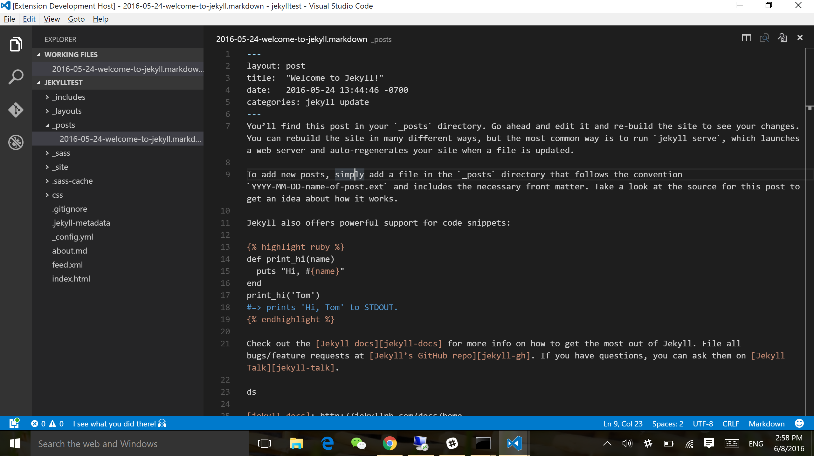

# Encourage
Encourage Package for Visual Studio Code, inspired by [@haacked](https://github.com/Haacked)'s [encourage-atom](https://github.com/Haacked/encourage-atom).

A Visual Studio Code extension that adds little encouragement while you work. It will be triggered automatically when the active document is saved or manually by command `Toggle Encourage`.

## Credit
All kudos to [@haacked](https://github.com/Haacked)
